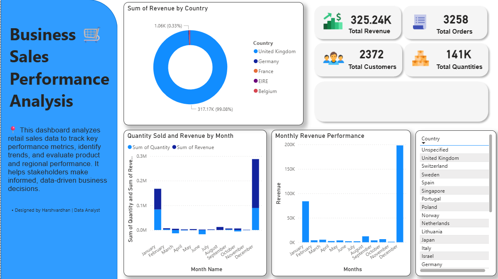

💼 Dashboard 2: Business Sales Performance Analysis
📌 Overview

The Business Sales Performance Analysis Dashboard tracks retail sales performance across countries, months, and key business metrics. It enables stakeholders to monitor revenue trends, customer behavior, and regional performance.

🎯 Objectives

Monitor overall business performance

Identify high-performing months and regions

Analyze revenue and quantity trends

Support strategic sales planning

📈 Key Metrics

Total Revenue: 325.24K

Total Orders: 3,258

Total Customers: 2,372

Total Quantity Sold: 141K

📊 Visualizations Included

Revenue distribution by country

Monthly revenue performance

Quantity sold vs revenue by month

Country-wise revenue contribution

Interactive country filter

🔍 Insights

United Kingdom contributes the majority of total revenue

December shows peak sales performance

Revenue trends indicate seasonal demand

Some countries show high quantity but low revenue

🛠 Tools Used

Power BI

DAX

Data Transformation

📂 Use Case

Ideal for:

Sales analysis

Business intelligence reporting

Market expansion strategy

Revenue forecasting

📌 Author

Harshvardhan Sutar
Data Analyst

