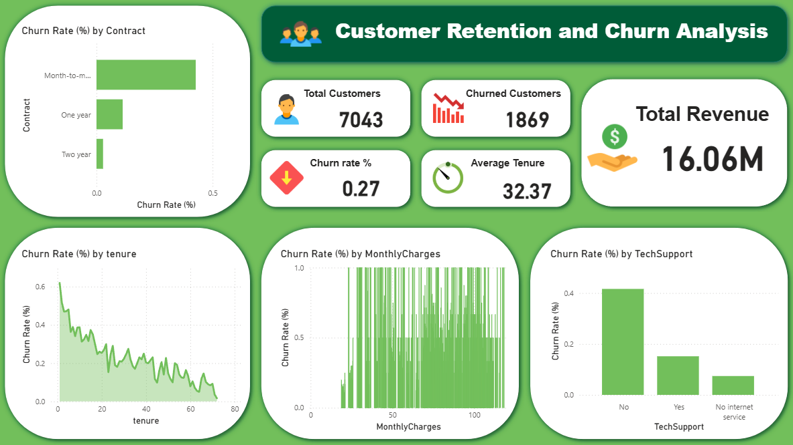
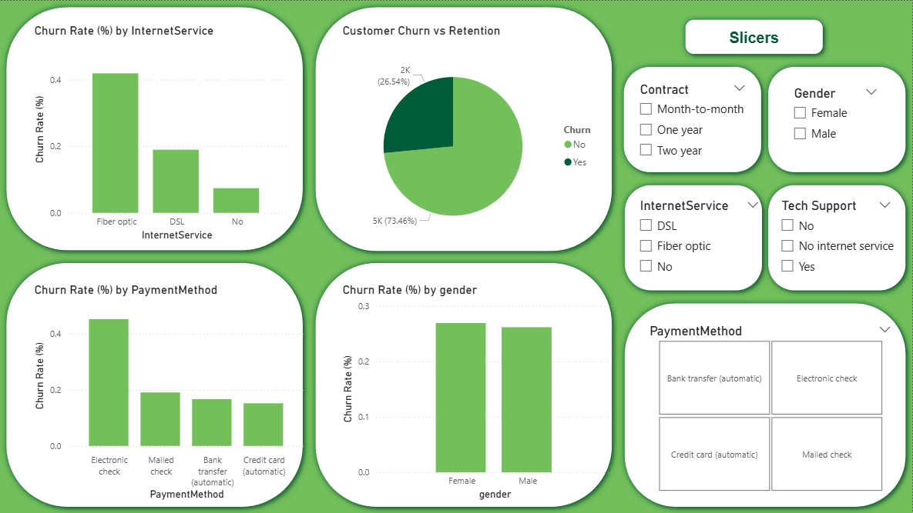

📊 Customer Retention & Churn Analysis
📌 Project Overview

Customer retention is a critical factor for subscription-based and SaaS businesses, as acquiring new customers is often more expensive than retaining existing ones.
This project focuses on analyzing customer churn behavior to identify why customers leave, which segments are at higher risk, and what actions can improve retention.

The analysis is presented through an interactive dashboard designed for business stakeholders, enabling data-driven decision-making.

🎯 Business Objectives

The key objectives of this analysis are:

Understand overall customer churn and retention levels

Identify customer segments with the highest churn risk

Analyze how tenure, pricing, contracts, and services impact churn

Provide actionable recommendations to reduce customer churn

📁 Dataset Used

Telco Customer Churn Dataset (Kaggle)

Contains customer demographics, subscription details, services used, billing information, and churn status

Each row represents a unique customer

Key Features Include:

Contract type

Tenure (customer lifetime)

Monthly and total charges

Services (Internet, Tech Support, Streaming, etc.)

Payment method

Churn status (Yes / No)

🛠 Tools & Technologies

Power BI – Data modeling, measures, and interactive dashboard creation

Microsoft Excel / Power Query – Data cleaning and preparation

📊 Key KPIs

The dashboard tracks the following key performance indicators:

Total Customers

Churned Customers

Churn Rate (%)

Average Customer Tenure

Total Revenue

📈 Dashboard Analysis & Visuals

The dashboard includes the following analyses:

Customer Churn vs Retention – Overall churn distribution

Churn Rate by Contract Type – Identifies high-risk contract models

Churn Rate by Tenure – Shows when customers are most likely to leave

Churn Rate by Monthly Charges – Evaluates pricing impact on churn

Churn Rate by Tech Support – Measures effect of customer support services

Churn Rate by Internet Service Type – Highlights service-related churn patterns

Churn Rate by Payment Method – Behavioral insights into payment preferences

Churn Rate by Gender – Demographic comparison

Interactive slicers allow filtering by:

Contract type

Gender

Internet service

Tech support

Payment method

🔍 Key Insights

Customers on month-to-month contracts have the highest churn rate

Early-tenure customers are more likely to churn compared to long-term customers

Customers with higher monthly charges show increased churn risk

Lack of tech support significantly increases churn

Electronic check users churn more than customers using automatic payment methods

Gender has minimal impact on churn behavior

💡 Business Recommendations

Based on the analysis, the following actions are recommended:

Encourage customers to shift from month-to-month to long-term contracts through incentives

Improve onboarding and engagement during the first few months

Promote or bundle tech support services for high-risk customers

Encourage automatic payment methods to improve retention

Review pricing strategies for customers with high monthly charges

📌 Conclusion

This project demonstrates how customer churn analysis can directly support business growth and revenue protection.
By identifying key churn drivers and customer behavior patterns, businesses can take proactive steps to improve customer retention and long-term profitability.

👤 Author

Harshvardhan Sutar
Data Analyst

🔗 Project Links

Dashboard:  

Dataset: https://www.kaggle.com/datasets/blastchar/telco-customer-churn